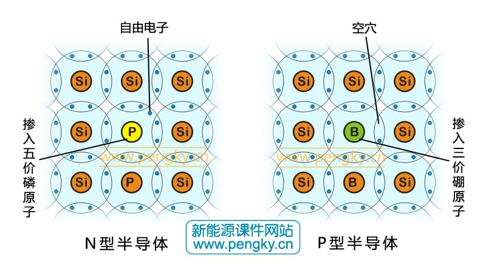
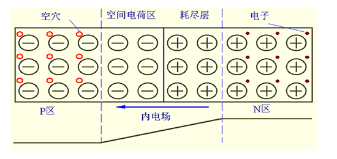
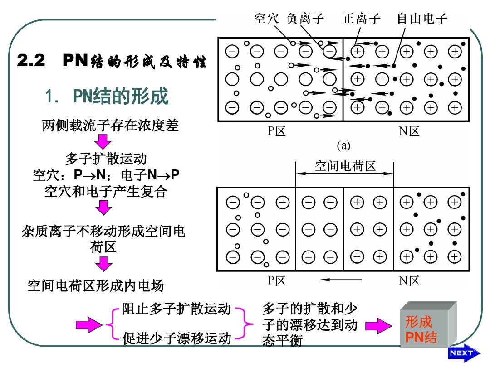

# 半导体器件

<!-- @import "[TOC]" {cmd="toc" depthFrom=1 depthTo=6 orderedList=false} -->

<!-- code_chunk_output -->

- [半导体器件](#半导体器件)
  - [本征半导体  （晶片）](#本征半导体--晶片)
  - [杂质半导体](#杂质半导体)
    - [N型半导体](#n型半导体)
    - [P型半导体](#p型半导体)
  - [PN结 （空间电荷区，耗尽层）](#pn结-空间电荷区耗尽层)
    - [PN结的单向导电性](#pn结的单向导电性)
      - [导通状态](#导通状态)
      - [截至状态](#截至状态)
    - [PN结的电容效应](#pn结的电容效应)

<!-- /code_chunk_output -->

---

## 本征半导体  （晶片）

**纯净的具有晶体结构的半导体称为本征半导体**  

- 本征半导体的要求
  - 半导体
  - 晶体

- 载流子
  - 自由电子
  - 阴阳离子
  - 空穴
  - ...

- 本征半导体具有两种载流子
  - 自由电子
    - 被激发的电子可能被原子核吸收或者碰撞其他电子，总之处于一个动态平衡之中  
  - 空穴 
    - (空穴可以填入自由电子，因此可以载电荷移动，多个空穴作用即可移动<mark>从高电位到低电位</mark>)

- 本征激发

  - 受到环境辐射影响
  - 

$$n_{i}=p_{i}=K_{1}T^{\frac{3}{2}}e^{\frac{-E_{GO}}{(2KT)}}$$

绝对0度的时候没有热运动，因此为绝对绝缘

## 杂质半导体

- 定义

  - 我们在晶体的结构基础上参加合适的杂质元素形成N型半导体和P型半导体
  - 注：也需要晶体结构

杂质半导体有两种常见的类型

- 杂质半导体

  - [N型半导体](#n型半导体)
  - [P型半导体](#p型半导体)

本征激发在杂质半导体之中并没有停止，只不过此时空穴载流子和自由电子载流子数量不同。自由电子载流子多称为多子，反则称为少子

- 杂质半导体的本征激发

  - 多子：占比多的为多数载流子

    - P型半导体的空穴
    - N型半导体的电子
  - 少子：占比少的为少数载流子

- **载流子的运动**

  - 热运动：半导体内的自由电子和空穴始终在进行着无规则的热运动，热平衡时热运动是随机的，载流子热运动的平均结果为净电流为0。
  - 扩散运动：当半导体内载流子浓度存在差异，载流子将从浓度高的区域自发地向浓度低的区域扩散，进而形成扩散运动。
  - 漂移运动：半导体内存在电场时，自由电子和空穴会在电场力的作用下产生运动，此即为载流子的漂移运动。

### N型半导体

使用5价的磷取替代一个硅，所以此使电子为多数载流子，因此N型半导体也被称为电子型半导体
Negative 

### P型半导体

使用三价元素替代Si例如B元素，此使会有空穴，空穴为多数载流子
Positive

**无论是P型半导体还是N型半导体都呈为电中性**
**无论N/P型半导体依然存在本征激发**

## PN结 （空间电荷区，耗尽层）

当两种半导体靠近时候，载流子浓度存在差异（扩散运动），N区域的电子势必会想P区的空穴扩散，刚开始的扩散速率较快，随着耗尽层的增大，内电场增大，然后漂移运动增强，最终扩散运动和漂移运动达到一种动态平衡。

- 耗尽层
  - 两种载流子的复合，耗尽了载流子。
  - 此时P原子真正的去了电子，B原子真正的得到了电子，形成了耗尽层

**内电场的出现导致了少子的漂移**最终导致动态平衡。  
由于本征激发的存在，半导体的导电性能与温度关系很大

### PN结的单向导电性

#### 导通状态

外接电场削减了内电场，使扩散增强

#### 截至状态  

外接电场增强了内电场，使电子的

### PN结的电容效应  

- 结电容

  - 势垒电容：反向电压，PN结变宽，电容效果变化
  - 扩散电容：正向电压，PN结变窄

