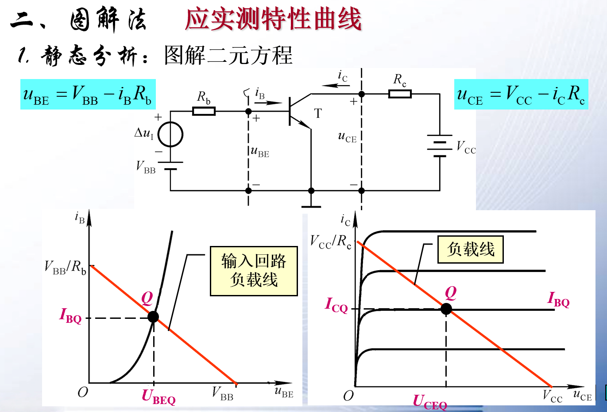
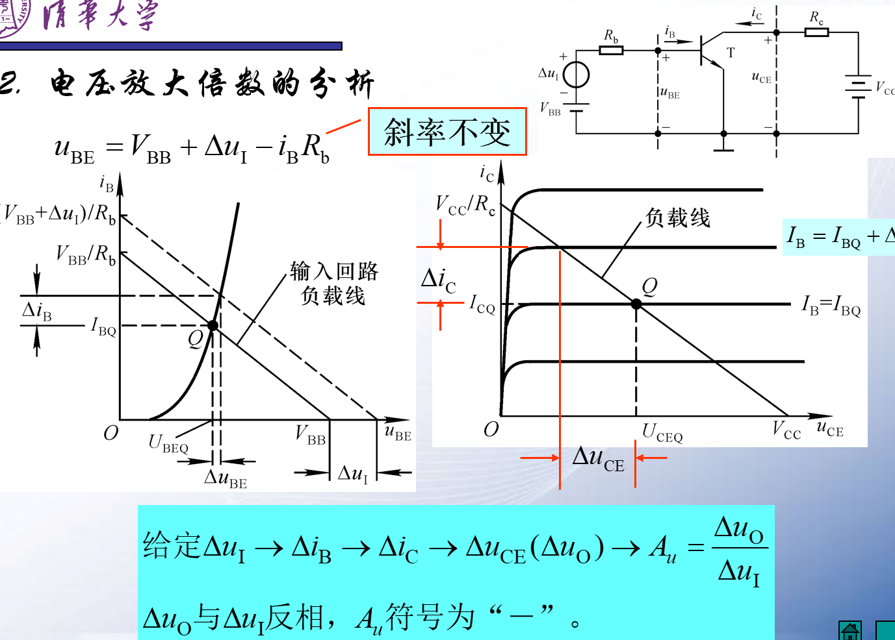
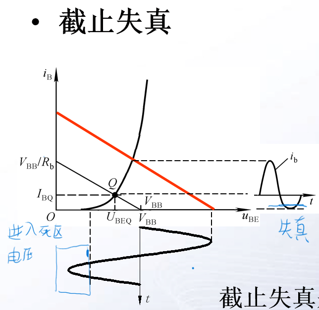
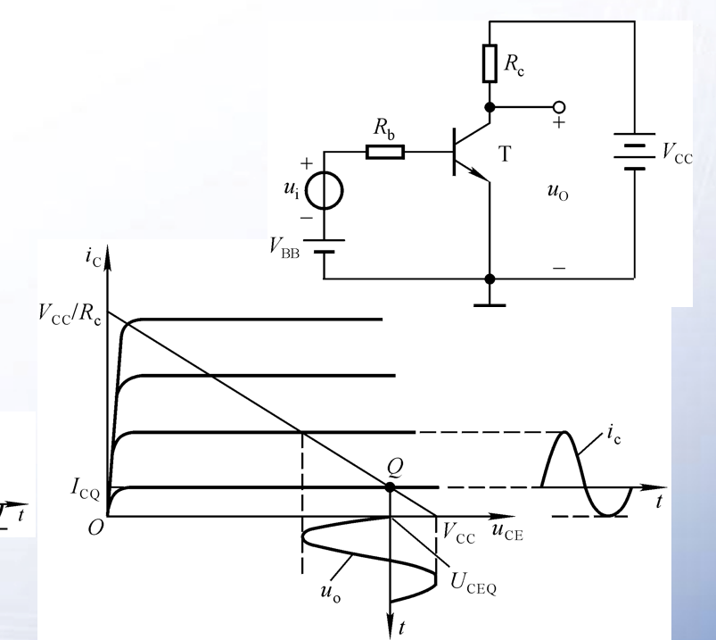
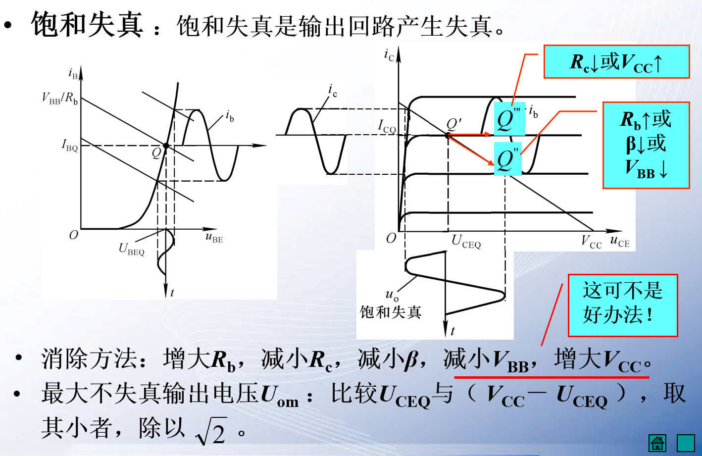
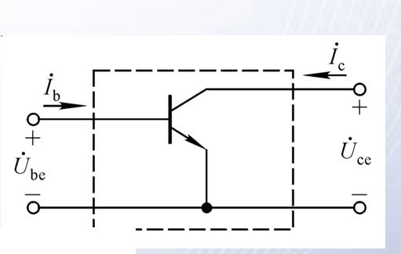
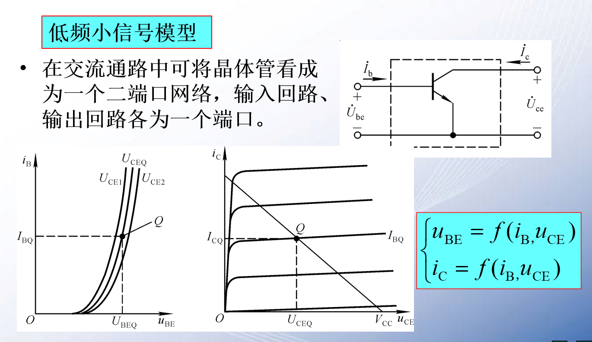
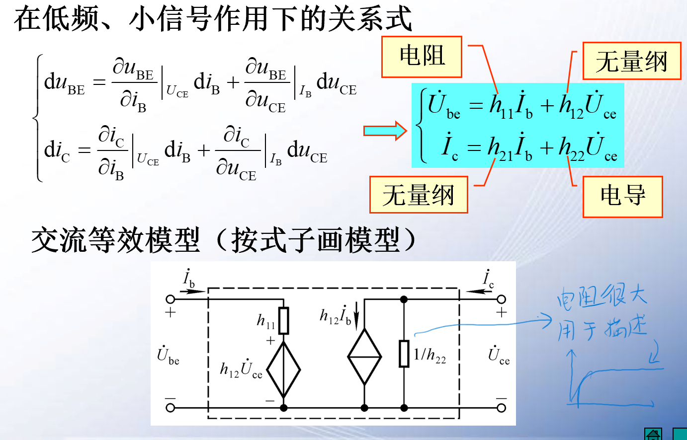
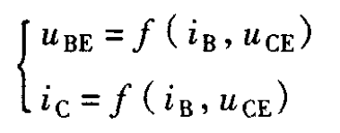
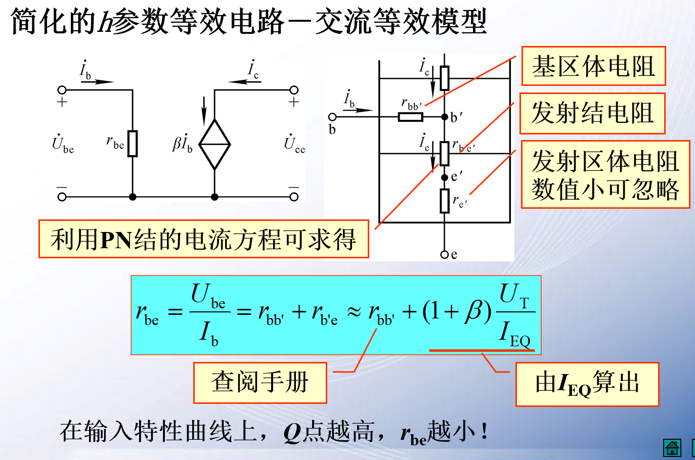

## 1 直流通路的交流通路  

- 直流：静态工作
- 交流：动态工作  
  - 我们的分析还能基于直流和交流的叠加，和纯粹的交流不同的是，模电的`交流`基于直流，是一种总体看的直流，但是却有波动，本质还是直流。

### 1-1 直流通路

1. $U_S=0$，保留$R_S$
2. 电容开路
3. 电感相当于短路（线圈电阻近似为0）

**用于计算静态工作点**
- 静态工作点
  - $I_B$，$I_B=\frac{U_C-U_{BE}}{R_B}$,我们往往认为$U_{BE}$是一个定值
  - $I_C$，$I_C=\beta I_B$
  - $U_{CE}$

### 1-2 交流通路

1. 电容短路
2. 直流电源相当于短路（内阻为0，我们指向计算交流部分）

**我们分析一个比较复杂的电路的时候往往分成两个部分进行分析**线路的计算是近似计算。1.直流部分，2.交流部分。我们往往先计算直流，再计算交流。

## 2 分析方法

- [图解法](#2-1-图解法)
- [等效电路法](#2-2-微变等效电路法)

### 2-1 图解法  

#### 2-1-1静态工作点的计算

**Q被称为静态工作点**

- 静态工作点的计算
  1. 根据输入端的回路电压防尘节后三极管输入曲线计算出$I_{BQ}$,$U_{BEQ}$
  2. 更具输出端的基尔霍夫方程结合三极管输出曲线计算出$U_{CEQ}$,$I_{CQ}$

#### 2-1-2 动态分析

- 动态分析 

#### 2-1-3 放大失真

- 原因分析
  1. 截止失真（进入死区，电流0）
  2. 饱和失真

##### 2-1-3-1 截止失真

##### 2-1-3-2 饱和失真

#### 2-1-4 直流和交流负载线

### 2-2 微变等效电路法

#### 2-2-1 直流模型：Q点分析。

我们把三极管想象成一个二端口网络。

- 双端口网络的参数
  1. Z（阻抗）参数
  2. Y（导纳）参数
  3. H（混合参数）参数

现在我们将忽略$h_{12}$,$h_{22}$

