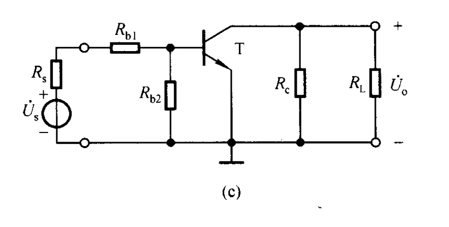

## 1 直流通路的交流通路  

- 直流：静态工作
- 交流：动态工作  
  - 我们的分析还能基于直流和交流的叠加，和纯粹的交流不同的是，模电的`交流`基于直流，是一种总体看的直流，但是却有波动，本质还是直流。

### 1-1 直流通路

1. $U_S=0$，保留$R_S$
2. 电容开路
3. 电感相当于短路（线圈电阻近似为0）

**用于计算静态工作点**
- 静态工作点
  - $I_B$，$I_B=\frac{U_C-U_{BE}}{R_B}$,我们往往认为$U_{BE}$是一个定值
  - $I_C$，$I_C=\beta I_B$
  - $U_{CE}$

### 1-2 交流通路

1. 电容短路
2. 直流电源相当于短路（内阻为0，我们指向计算交流部分）

**我们分析一个比较复杂的电路的时候往往分成两个部分进行分析**1.直流部分，2.交流部分。例如下图的电路
