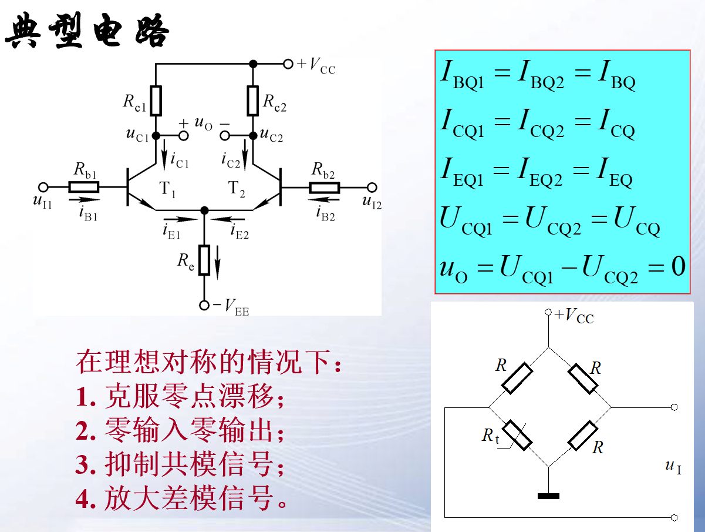
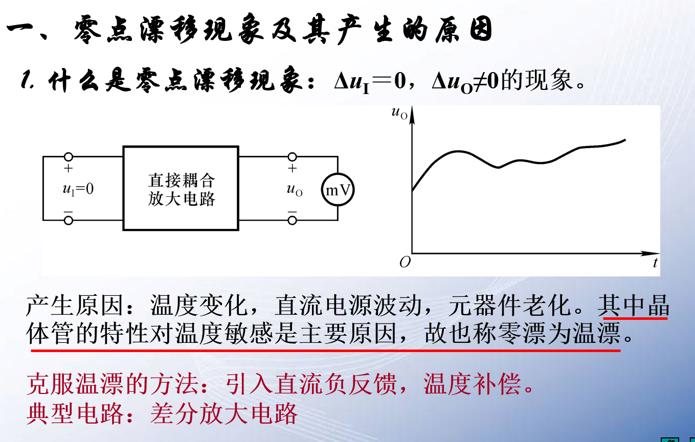
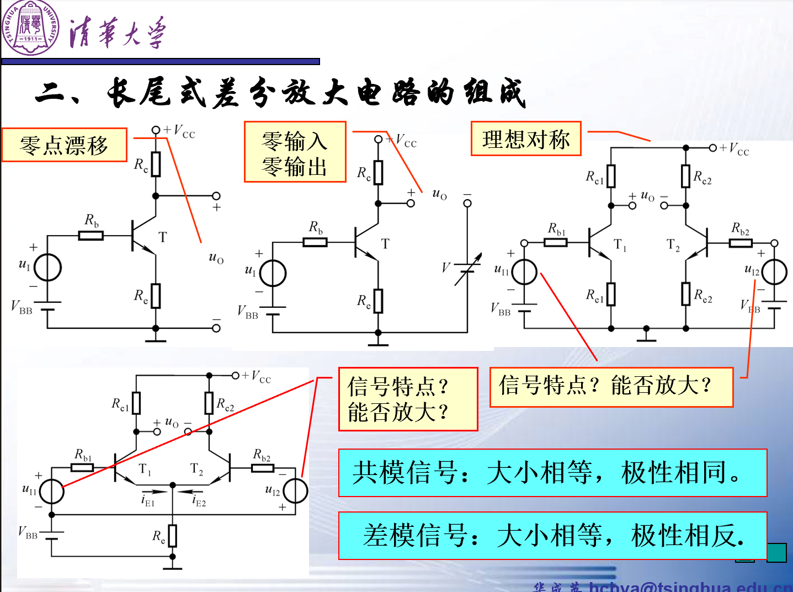

# 差分放大电路

差模，共模，比较  

<!-- @import "[TOC]" {cmd="toc" depthFrom=1 depthTo=6 orderedList=false} -->

<!-- code_chunk_output -->

- [差分放大电路](#差分放大电路)
  - [1 差分放大电路](#1-差分放大电路)
  - [2 零点漂移现象](#2-零点漂移现象)
  - [3 差分放大电路的组成](#3-差分放大电路的组成)

<!-- /code_chunk_output -->

---
## 1 差分放大电路  

**差分放大电路往往作为运放的第一级放大，用于稳定静态工作点减少零点漂移带来的影响。**

## 2 零点漂移现象

**第一级的三极管对放大电路的影响最大**
温度变化，电源电压等外部因素都会影响，而且第一级受到的波动会被后面的放大电路放大。因此零点会漂移。

==零点漂移的本质就是静态工作点不稳定==
我们可以采取分压式偏置电路，温度补偿，二极管补偿等方法进行修正。总之我们可以通过 **设置稳定静态工作点**来减少零点漂移的影响。

## 3 差分放大电路的组成

1. 差模信号:$u_{11} = - u_{22}$
2. 共模信号:$u_{11}  = u_{22}$
3. 比较信号:$u_{11} \neq \pm u_{22}$

**比较 = 差模 + 共模**
