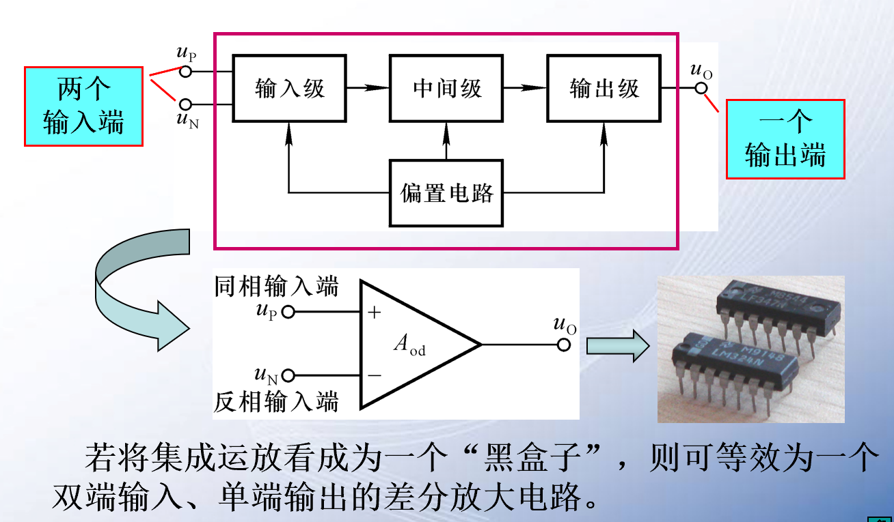
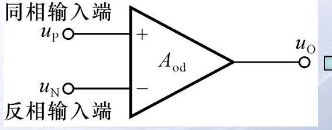
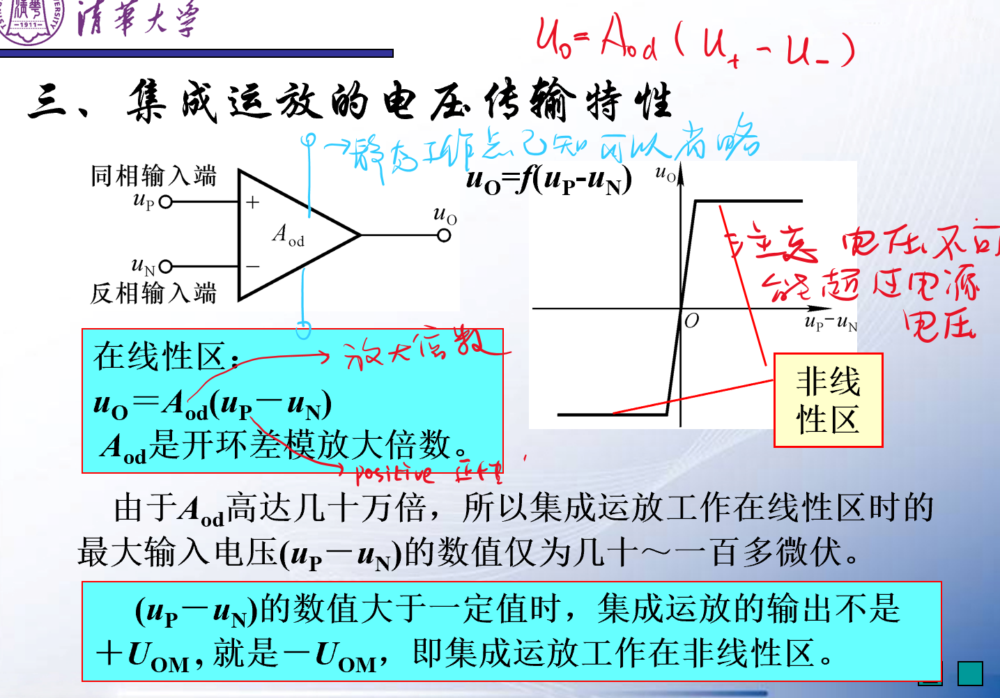
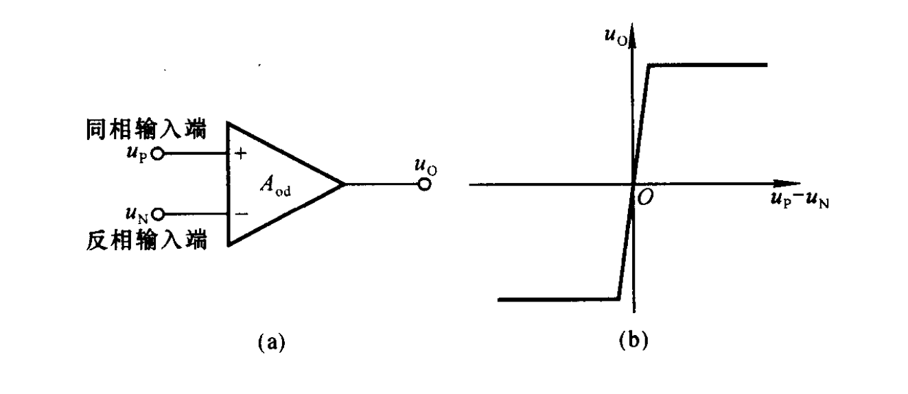

# 集成放大电路

<!-- @import "[TOC]" {cmd="toc" depthFrom=1 depthTo=6 orderedList=false} -->

<!-- code_chunk_output -->

- [集成放大电路](#集成放大电路)
  - [0 概论](#0-概论)
  - [1 集成放大电路的特点](#1-集成放大电路的特点)
  - [2 集成电路的成分和作用](#2-集成电路的成分和作用)
  - [3 集成电路的电压传输特性](#3-集成电路的电压传输特性)

<!-- /code_chunk_output -->

---

## 0 概论

电路有模拟和数字之分
我们常用的计算机时数字计算的结果，而模拟电路这门课程注重在于模拟电路分析。

我们将电路封装在一起组成集成放大电路
**集成放大电路简称运放，往往有很多级放大电路组成**

## 1 集成放大电路的特点  

三极管和场效应管他们都称为有源元器件。偏置是指静态工作点的设置。

## 2 集成电路的成分和作用  

**运放**的符号
  
**其实还有两个引脚用于联接直流电源**，但是我们省略了两个引脚，只需要给出他工作的静态工作点即可。  

## 3 集成电路的电压传输特性  

==电源电压已经决定了放大电路的极限==
注意，线性放大区间非常的狭窄。  
而且运放电路具有正负性，可以反向。
放大倍数
$$u_\mathrm{O}=f(u_{\mathrm{P}}-u_{\mathrm{N}})$$

电源电压有上限

==**零点漂移问题经过多级后会产生不小的影响，所以我们往往将差分放大电路作为第一级来减少这种影响**==
常常用`对称性`来回答差分放大的原理。

