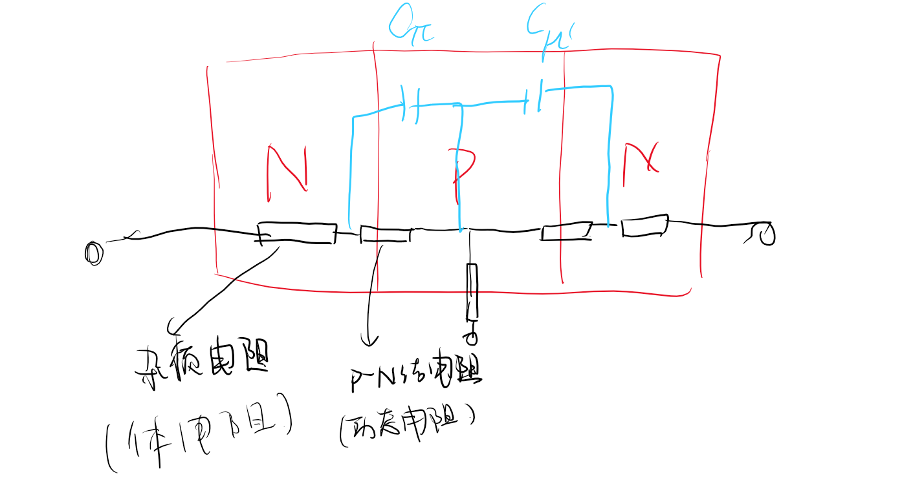
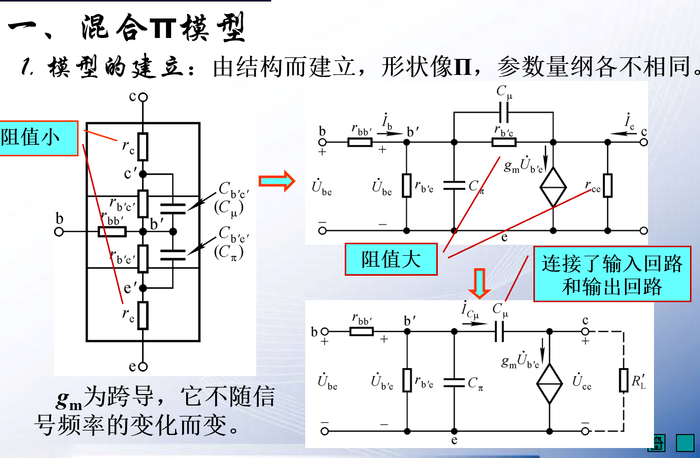
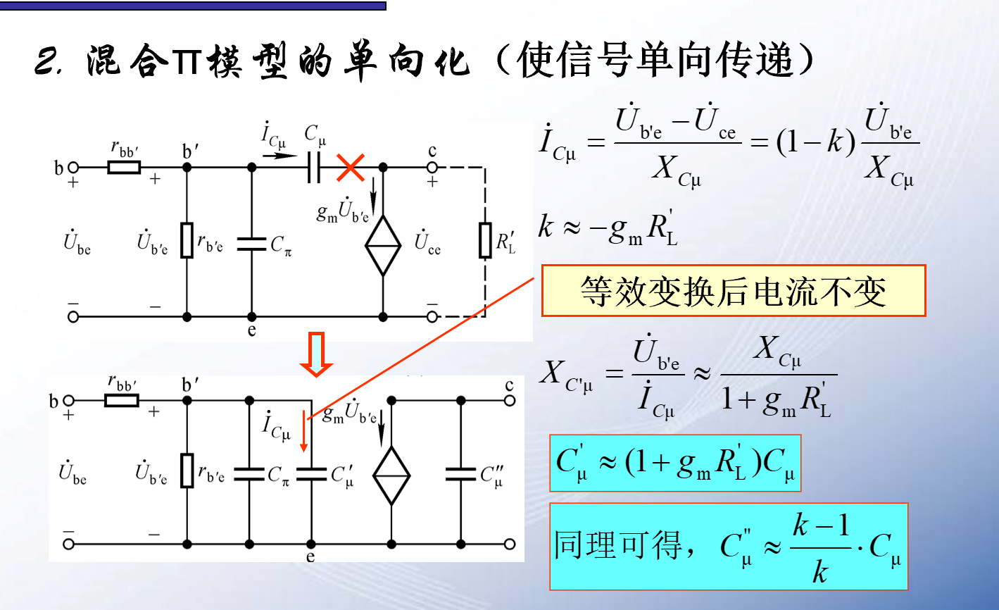
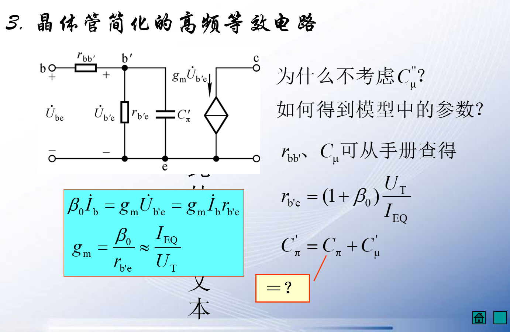
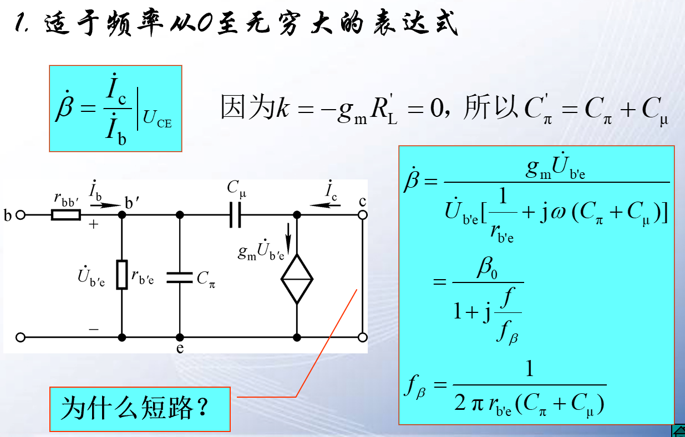
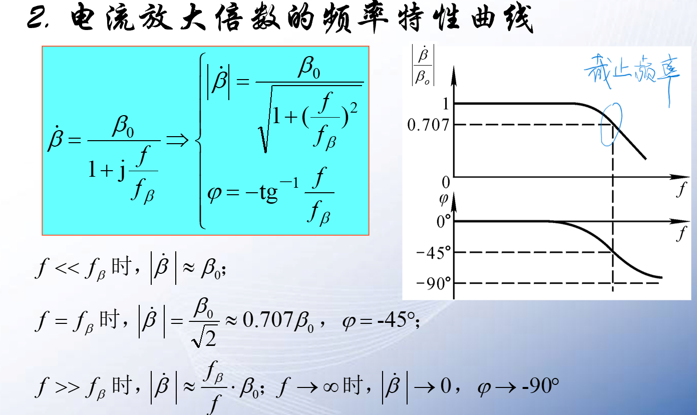
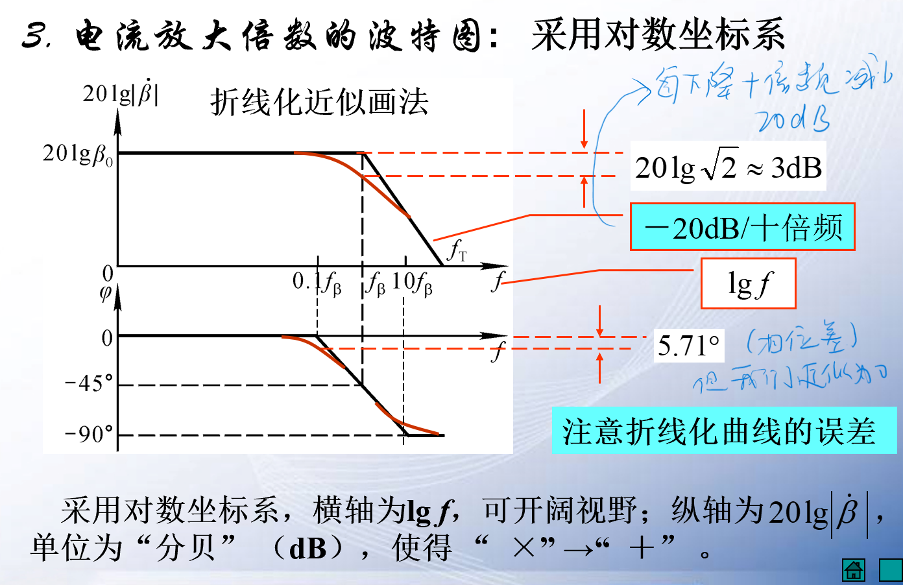
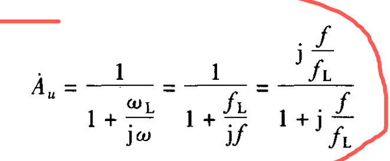

# 高频等效电路 

<!-- @import "[TOC]" {cmd="toc" depthFrom=1 depthTo=6 orderedList=false} -->

<!-- code_chunk_output -->

- [高频等效电路](#高频等效电路)
  - [1 等效模型](#1-等效模型)
    - [1.1 混合Π模型](#11-混合π模型)
    - [1.2 简化近似的三极管高频等效电路](#12-简化近似的三极管高频等效电路)
  - [2 电流放大倍数的频率响应](#2-电流放大倍数的频率响应)
    - [2.1 特性曲线](#21-特性曲线)
    - [2.2 伪波特图](#22-伪波特图)

<!-- /code_chunk_output -->

---

**之前的等效电路模型只适用于低频信号的作用，高频情况电容相当于短路。**

三极管有两个PN结，故有两个结电节电容，频率比较低的时候这个电容几乎没有作用，而当高频情况下，PN结的容抗极小，基极电流直接通过结电节电容。

==因此我们需要建立新的等效模型。==

## 1 等效模型 

### 1.1 混合Π模型  

这是一个双端口网络。具有双向传递的性质
而反向的影响非常小，所以我们干脆单向化。

**单向化传递**

$C_{\mu}^{''}\approx C_{\mu}$
本质控制就是$b^{'}e$段的电压控制电流源的电流大小。
就是纯粹的PN结电压不包含$r_{bb^{'}}$上的电压。即$U_{b'e}$的电压。
我们不再使用$I_C = \beta I_B$

==现在的对应关系变成了电压和电流的关系==

右边加电压，左边电压很小（电流源没开启），左边加电压右边可以很大，电流源开启。因此我们干脆单项化。

### 1.2 简化近似的三极管高频等效电路

**经过了三次的等效近似，我们得到了三极管的高频等效电路**
r5

$U_T = 26 \ mV$

$C_{\pi}' = C_{\pi} + C_{\mu}'$

我们需要注意的是$b'$的出现以及现在是使用结电节电压取控制电流。

## 2 电流放大倍数的频率响应  

### 2.1 特性曲线
存在截止频率
频率很低的时候$\beta_0$当频率到达截止频率的时候：$f=f_{\beta}....$

### 2.2 伪波特图  

**由于频率范围十分的广，为了把如此宽的范围表示在一张图里面，我们需要采取对数坐标。**

对数坐标相当于把区间压缩。
波特图采用对数坐标。注意纵横坐标的$\lg$倍数不同。
==重要的公式==

$f_L$是下限频率

上限频率。
